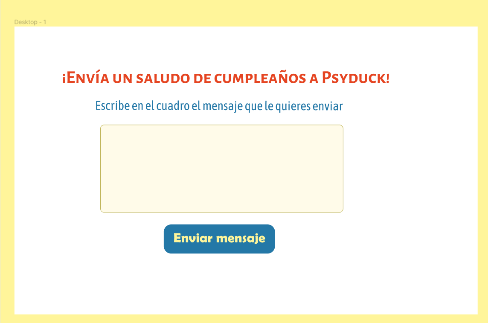

# Traductor Pokemon

### Introducción
El traductor Pokemon fue creado a partir del primer proyecto del bootcamp de Laboratoria llamado Cipher. Este consisitía en crear una aplicación web en que los/as usuario/as puedan cifrar y descifrar un texto indicando un desplazamiento de caracteres.

### Proceso de creación y diseño
El traductor Pokemon fue pensado como un apartado en alguna app en que niños y niñas puedan escribir un saludo de cumpleaños a su Pokemon Favorito, con fines de entretención. Los Pokemon elegidos para este caso fueron Psyduck, Pikachu y Eevee. Cada pokemon representa un número de desplazamiento distinto. 

Al enviar el mensaje, el/la usuario/a se da cuenta que el Pokemon no entiende su mensaje y lo debe traducir. Aquí actúa la función de cifrado, "traduciendo" el mensaje al idioma del Pokemon, desplazando los caracteres del mensaje original en un número determinado y obteniendo un nuevo mensaje. Finalmente, se puede visualizar el mensaje original ingresado por el/la usuario.

Las primeras dos pantallas de la aplicación las diseñé en Figma. Pensé en crear un diseño sencillo y fácil de usar. Elegí los colores característicos de la franquicia Pokemon.
Adjunto imágenes del diseño en Figma: 

 Luego,  seguí dando los estilos desde CSS, ajustando colores y tipografía, llegando al siguiente diseño final:

 

 Como mencioné anteriormente, cada Pokemon tiene un número de desplazamiento distinto, lo que hace que el mensaje cifrado se vea diferente para cada Pokemon. 
 
 Link al proyecto https://solgonz.github.io/SCL017-cipher/
